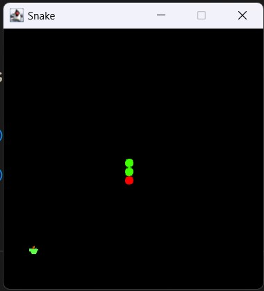

### JPanel :
1. Simplest container class. 
2. Provides space in which an application can attach any other component. 
3. JPanel() is used to create a new JPanel with double buffer and a flow layout.

parent hierarchy ->

```
    java.lang.Object
    
        java.awt.Component
        
            java.awt.Container
            
                javax.swing.JComponent
```
 

> **Double-buffering** - It is used primarily to eliminate visible draws which can make an application look amateurish, sluggish, or appear to flicker.
                      Swing uses a "passive rendering" algorithm, where paints are performed only when they need to be. You can make suggestions to the API about when                       something should be update via the repaint() call.
                      
> **Passive-rendering** - in traditional GUI the application doesnt know when the user id going to move, resize, expose, or cover an application by another window until it actually happens. In Java GUI application, the OS delivers a paint event to the AWT, which figures out what needs to be painted, where it creates a java.awt.Graphics object with the appropriate clipping region, the calls the paint method 
                    with that Graphics object. 
## Why JPanel?
to build a space for game that is by default provided by top level swing containers like JFrame, JDialog, JApplet.

## ActionListener :

    java.awt.event 
    extends EventListener
    
1. Used for recieving action events. 
2. Used by the class that is interested in processing an action event implements this interface.


## Timer:

    java.util.Timer
    extends Object
    
It facilitate threads to schedule tasks for future execution in a background thread. 


## Image:
    
    java.awt.Image
    extends Object
    
The abstract class Image is the super class of all classes that represent graphical images.

## keyAdapter:
    
    java.awt.event
    implements keyListener 
    
It is an adapter class for recieving keyboard events.
